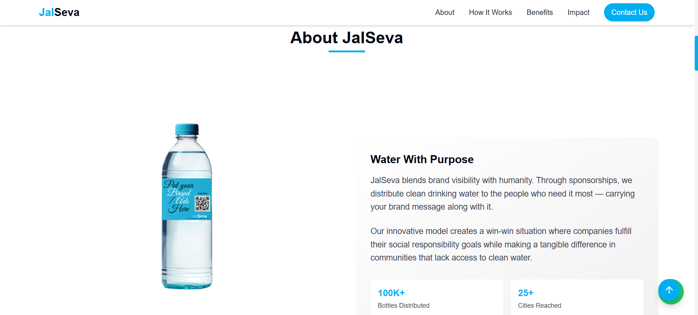
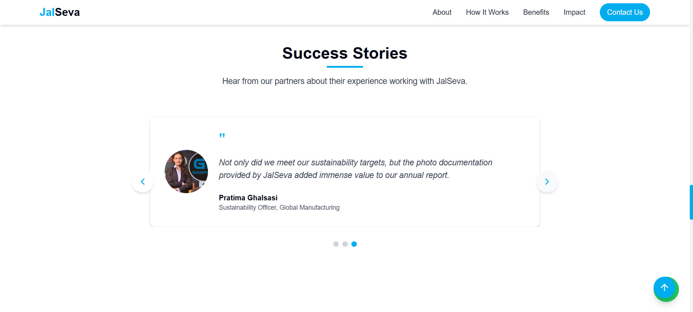
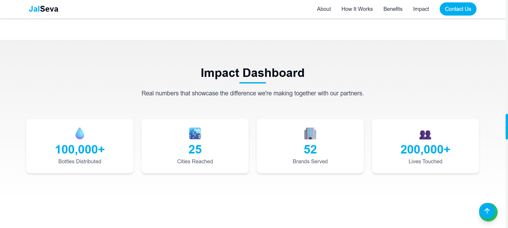
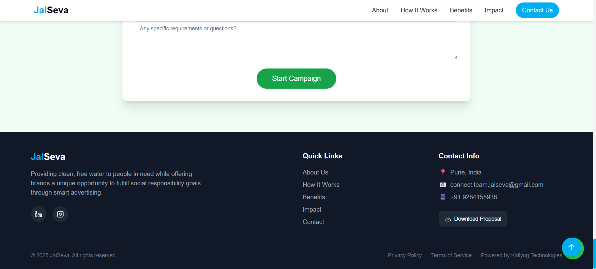

<h1 align="center">🌊 JALseva — Empowering CSR for a Better Tomorrow</h1>

<p align="center">
  
  
  
</p>

<p align="center">
  <strong>Live App ➤</strong> <a href="https://jalseva.netlify.app/">jalseva.netlify.app</a> • 
  <strong>GitHub ➤</strong> <a href="https://github.com/RishiDalvi/jalseva_Project">RishiDalvi/jalseva_Project</a>
</p>

---

## 🌟 Project Overview

**JALseva** is a CSR (Corporate Social Responsibility)-driven initiative that bridges the gap between companies seeking meaningful social impact and water-centric community needs. Companies often spend CSR funds but struggle to measure or showcase impact — **JALseva solves this problem** by offering an end-to-end platform for project discovery, funding, tracking, and impact visualization.

---

## 🔥 Highlights

- Transparent CSR project management
- Real-time impact dashboard
- Verified success stories from communities
- Easy onboarding for donors and NGOs
- Fully responsive & accessible UI

---

## 🚀 Tech Stack

| Tech            | Description                              |
|-----------------|------------------------------------------|
| Vite            | Superfast bundler & development server   |
| TypeScript      | Type-safe development                    |
| React           | Component-based UI                       |
| Tailwind CSS    | Utility-first styling                    |
| shadcn-ui       | Prebuilt elegant UI components           |
| React Router    | For client-side routing                  |
| Netlify         | Deployment platform                      |

---

## 🖼️ UI Screenshots

> Here's a quick look at the platform 👇

### 🏠 Landing Page


---

### 📖 About Us


---

### ⚙️ How It Works


---

### 🌟 Success Stories


---

### 📊 Impact Dashboard


---

### 🔗 Footer with Privacy and Terms


---

## 🧠 Problem Statement

> **Corporates use CSR funds, but they rarely get transparent insights or real social engagement benefits.**

Most organizations fund NGOs without an interactive medium to see their impact or engage users. This causes low visibility, inefficiency, and less accountability.

---

## ✅ Solution by JALseva

- 📌 Platform for listing verified water-based CSR projects.
- 🧾 Real-time tracking, updates, and dashboards.
- 🏆 Reward systems, recognition badges for corporates.
- 🌍 Success stories to inspire and promote further impact.

---

## 🛠️ Project Setup – Local Installation

```bash
# Clone the repository
git clone https://github.com/RishiDalvi/jalseva_Project

# Navigate to project directory
cd jalseva_Project

# Install dependencies
npm install

# Start development server
npm run dev


<div align="center">
  
  <h1 align="center">JalSeva – Empowering Impact with CSR Transparency</h1>
  <p align="center">
    A platform bridging <strong>businesses</strong> and <strong>nonprofits</strong> through transparent CSR fund utilization, real-time dashboards, and verifiable success stories.
  </p>
  <p align="center">
    <a href="https://jalseva.netlify.app/">🌐 Visit the Live Website</a> • 
    <a href="https://github.com/RishiDalvi/jalseva_Project">📦 GitHub Repo</a>
  </p>
</div>

---

## 📸 Screenshots

| Landing Page | About Us | How It Works |
| ------------ | -------- | ------------ |
|  |  |  |

| Success Stories | Impact Dashboard | Footer |
| --------------- | ---------------- | ------ |
|  |  |  |

---

## 🚀 Project Overview

**JalSeva** solves a major gap in the CSR (Corporate Social Responsibility) ecosystem. While companies contribute funds, the impact is often unclear or unverifiable. Our platform:

- Ensures transparency of CSR fund usage.
- Enables businesses to view real-time impact via a custom dashboard.
- Allows NGOs to showcase verified success stories.
- Offers a credible platform for stakeholders to collaborate meaningfully.

---

## 🔧 Tech Stack

| Layer         | Technology                                |
|--------------|--------------------------------------------|
| Frontend     | [React](https://reactjs.org/), [TypeScript](https://www.typescriptlang.org/), [Vite](https://vitejs.dev/) |
| Styling      | [Tailwind CSS](https://tailwindcss.com/), [shadcn/ui](https://ui.shadcn.dev/) |
| State Mgmt   | React State, useState/useEffect hooks       |
| Assets       | Stored in `/public/images` and `/assets`   |
| Backend      | [Supabase Functions](https://supabase.com/) |
| Deployment   | [Netlify](https://netlify.com/)            |
| Dev Tools    | ESLint, Prettier, PostCSS, Vite Dev Server  |

---

## 📁 Folder Structure

```bash
jalseva_Project/
├── public/                 # Public assets and favicons
├── screenshots/            # Screenshots for README and docs
├── src/
│   ├── assets/             # Static project assets
│   ├── components/         # UI components
│   ├── hooks/              # Reusable React hooks
│   ├── integrations/       # External integrations (e.g., Supabase)
│   ├── lib/                # Utility functions
│   ├── pages/              # Individual page routes
│   ├── App.tsx             # App wrapper
│   └── main.tsx            # React root
├── supabase/               # Supabase functions and migrations
├── tailwind.config.ts      # Tailwind configuration
├── vite.config.ts          # Vite build configuration
└── README.md               # You're reading it!


| Feature                       | Description                                        |
| ----------------------------- | -------------------------------------------------- |
| 🔍 Discover Projects          | Browse live water-saving projects eligible for CSR |
| 💸 Easy Donations             | Seamless UI for funding and collaboration          |
| 📊 Dashboard                  | View real-time impact stats                        |
| 🧑‍🤝‍🧑 NGO/Corporate Logins | Separate dashboards with permissions               |
| 🌱 Sustainable Design         | Eco-themed and mobile-first UI                     |


🎯 Future Scope
Integration with Government APIs

Blockchain-based impact verification

CSR Impact Leaderboard across India

Real-time Chatbot support


🤝 Contributing
Contributions are welcome! Feel free to fork and submit PRs.
# Fork the project
# Make changes
# Push your feature branch
# Create Pull Request


📃 License
This project is licensed under the MIT License.


📬 Connect With Us
Founder: Rushikesh Dalavi

Email: connect.team.jalseva@gmail.com

LinkedIn: Kaliyug Technologies
